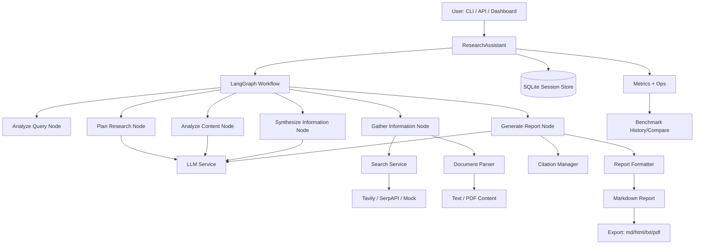

# Research Assistant

Production-style, multi-provider research workflow built with LangGraph, FastAPI, and Typer CLI.

It plans a query, decomposes it, searches sources, analyzes evidence, synthesizes sections, enforces quality gates, and exports reports (`md`, `html`, `txt`, `pdf`) with benchmark + dashboard tooling.

## Highlights

- Multi-step graph workflow (`analyze -> plan -> gather -> analyze -> synthesize -> report`)
- Pluggable LLM providers: `openai`, `openrouter`, `groq`, `xai/grok`, `ollama`, `mock`
- LLM routing by node/task (`planning`, `analysis`, `writing`)
- Retry + provider/model fallback chains
- Search providers: `tavily`, `serpapi`, `mock`
- Async sessions with persistent SQLite store
- API auth + simple rate limiting
- Quality gates:
  - minimum reference count
  - minimum unique source domains
  - optional hard enforcement
- Adaptive depth reruns when quality fails and budget allows
- Benchmark runner + history + compare
- Dashboard with stage timeline, live status, report browsing, and export helpers
- CI pipeline with secret scan + test run + benchmark smoke run

## System Architecture



## Repository Layout

```text
src/research_assistant/
  api.py                FastAPI app + dashboard endpoint
  assistant.py          Orchestrator + async sessions + persistence glue
  main.py               Typer CLI + report export + benchmark tooling
  config.py             Env-driven settings
  storage.py            SQLite session store
  graph/
    workflow.py         LangGraph graph construction
    nodes.py            Node implementations
    edges.py            Conditional transitions
    state.py            Typed workflow state
  services/
    llm.py              Provider clients, retries, fallbacks, metrics
    search.py           Tavily/SerpAPI/mock retrieval
    parser.py           Text/PDF parsing
    citation.py         Citation indexing/normalization
    formatter.py        Markdown report generation
  web/dashboard.html    Browser dashboard UI

tests/
  unit/                 Service, node, parser, routing, quality tests
  integration/          CLI, API, benchmark, persistence, e2e routing tests
```

## Getting Started

### 1) Install

```bash
python -m venv .venv
. .venv/Scripts/activate
pip install -e .[dev]
```

### 2) Configure Environment

Create `.env` in project root:

```env
# LLM
LLM_PROVIDER=openrouter
LLM_MODEL=openai/gpt-oss-120b:free
OPENROUTER_API_KEY=your_openrouter_key

# Optional per-task model routing
LLM_MODEL_PLANNING=
LLM_MODEL_ANALYSIS=
LLM_MODEL_WRITING=

# Retry/fallback
LLM_RETRY_MAX_ATTEMPTS=4
LLM_RETRY_BASE_DELAY_S=1.0
LLM_RETRY_MAX_DELAY_S=8.0
LLM_ROUTE_FALLBACK_ENABLED=true
LLM_FALLBACK_PROVIDER=
LLM_FALLBACK_MODEL=
LLM_SECOND_FALLBACK_PROVIDER=
LLM_SECOND_FALLBACK_MODEL=

# Optional provider credentials
OPENAI_API_KEY=
GROQ_API_KEY=
XAI_API_KEY=
OLLAMA_BASE_URL=http://127.0.0.1:11434

# Search
SEARCH_PROVIDER=tavily
TAVILY_API_KEY=your_tavily_key
# SEARCH_PROVIDER=serpapi
# SERPAPI_API_KEY=your_serpapi_key

# Research controls
MAX_SEARCH_RESULTS=5
MAX_SUB_QUESTIONS=5
MAX_RESEARCH_ITERATIONS=5
MIN_RELEVANCE_SCORE=0.8
MIN_UNIQUE_SOURCE_DOMAINS=2
MIN_REFERENCE_COUNT=3
QUALITY_GATE_ENFORCE=false
MAX_TOTAL_TOKENS_PER_QUERY=0
MAX_SECONDS_PER_QUERY=0
ADAPTIVE_DEPTH_ENABLED=true
ADAPTIVE_MAX_PASSES=1
ADAPTIVE_SUB_QUESTIONS_INCREMENT=1
ADAPTIVE_ITERATIONS_INCREMENT=1

# Storage / API guards
REPORTS_DIRECTORY=./reports
SESSION_DB_PATH=./reports/sessions.db
API_AUTH_TOKEN=
API_RATE_LIMIT_PER_MINUTE=0
```

## CLI Usage

### Run a query

```bash
research-assistant run "Impact of AI on education"
```

### Async progress watch

```bash
research-assistant watch <session_id>
```

### Metrics

```bash
research-assistant metrics
research-assistant metrics --json
research-assistant metrics --reset --yes
```

### Benchmark

```bash
research-assistant benchmark --num-queries 3 --json
research-assistant benchmark --num-queries 3 --pause-seconds 2 --json
research-assistant benchmark-history --limit 10 --json
research-assistant benchmark-compare --json
```

### Report Browser and Export

```bash
research-assistant reports list --json
research-assistant reports show latest --full
research-assistant reports show latest --kind session
research-assistant reports export --from latest --to html --output reports/latest_report.html
research-assistant reports export --from latest --to pdf --output reports/latest_report.pdf
research-assistant reports export --from latest --to md --output reports/latest_report.md
```

## API Usage

Start server:

```bash
uvicorn research_assistant.api:app --host 127.0.0.1 --port 8000
```

Dashboard:

- `http://127.0.0.1:8000/dashboard`

API examples:

```bash
curl -X POST http://127.0.0.1:8000/api/v1/research \
  -H "Content-Type: application/json" \
  -H "X-API-Key: <token-if-enabled>" \
  -d "{\"query\":\"Impact of AI on education\"}"
```

```bash
curl http://127.0.0.1:8000/api/v1/research/<session_id>/status
curl http://127.0.0.1:8000/api/v1/research/<session_id>/result
curl -X POST http://127.0.0.1:8000/api/v1/research/<session_id>/cancel
curl http://127.0.0.1:8000/api/v1/reports?limit=20
curl http://127.0.0.1:8000/api/v1/benchmarks/history?limit=10
```

## Dashboard Features

- Start/cancel session with live status
- Stage timeline with animated progress
- Stage details: current stage, sub-questions, iteration count
- Report viewer with rendered/raw tabs
- Latest source mode: `all`, `file`, `session`
- Export shortcuts: HTML, MD, PDF (print flow)
- Benchmark history + latest comparison panel

## Quality, Safety, and Reliability

- URL deduplication in retrieval
- Citation normalization + placeholder rejection
- Citation isolation per run (no cross-session leakage)
- Source diversity and reference count checks
- Optional hard quality gate enforcement
- LLM retries with backoff and capped delay
- Fallback providers/models when primary fails
- Budget guardrails:
  - max tokens/query
  - max duration/query

## Testing

Run all tests:

```bash
pytest -q
```

Current suite includes:

- Unit tests for node normalization, parser/pdf handling, routing, retries, usage metrics, citations
- Integration tests for CLI/API/benchmark/persistence/model-routing/progress behavior

## CI

GitHub Actions workflow: `.github/workflows/ci.yml`

CI jobs:

1. Install package (`pip install -e .[dev]`)
2. Run secret hygiene scan (`python scripts/scan_secrets.py`)
3. Run tests (`pytest -q`)
4. Run benchmark smoke (`research-assistant benchmark --num-queries 1 --json --reset-first`)

## Security and Key Hygiene

- `.env` is git-ignored
- Never commit API keys
- Rotate keys exposed in terminal/chat/history
- Optional local pre-commit check:

```bash
python scripts/scan_secrets.py
```

## Known Constraints

- If using free/shared API models, expect occasional rate limits (`429`)
- `mock://` links are valid references for local mock mode, but not web-browsable
- Dashboard export-to-PDF uses browser print flow; CLI supports direct `--to pdf`

## License

Add your preferred license file before open-source release.
